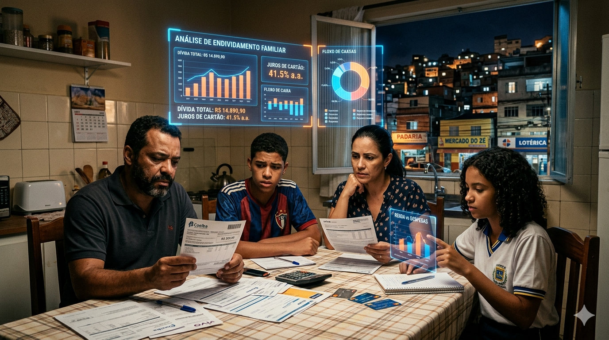

# 📊 O Endividamento das Famílias Brasileiras e a Interpretação de Dados via Inteligência Artificial

## 🎯 Motivação da Escolha do Tema

Sempre tive interesse em analisar tabelas de jogos de futebol ⚽ para entender quais resultados eram necessários para que meu time pudesse conquistar um campeonato. Além disso, também gosto de analisar resultados políticos 🗳️, observando como ocorre a distribuição de votos entre os candidatos.

Durante o Bootcamp Bradesco – GenAI, Dados & Cyber 💻🤖, foi proposto um desafio utilizando o NotebookLM com fontes limitadas, na geração e interpretação de informações.

Ao mesmo tempo, o cenário atual apresenta grande destaque para o aumento do endividamento das famílias brasileiras 💰📉, que já ultrapassa 80% em alguns levantamentos divulgados pela mídia. Esse contexto despertou o interesse em explorar como ferramentas baseadas em inteligência artificial podem auxiliar na análise de dados 📊, interpretação de informações 🧠 e geração de respostas em temas relevantes para a sociedade. motivos, impactos e possíveis soluções.

## 🎯 Objetivos

Analisar o desempenho do NotebookLM utilizando fontes limitadas, com o objetivo de compreender o cenário de endividamento das famílias brasileiras, investigando suas principais causas ⚠️, impactos sociais e econômicos 📉, bem como possíveis soluções 💡 apresentadas nas fontes analisadas.

## 🛠️ Metodologia

O NotebookLM será alimentado com cinco PDFs 📚 contendo abordagens diferentes sobre o mesmo tema. O objetivo é analisar como o modelo interpreta, relaciona e utiliza as informações presentes nas fontes fornecidas.

As perguntas serão divididas em fases 🔄.

Na primeira fase 🥇, serão realizadas perguntas variando entre questões simples, perguntas com restrições específicas e diferentes tipos de saída esperada.

Na segunda fase 🥈, serão aplicadas perguntas com o objetivo de avaliar a capacidade de argumentação do LLM 🧠, analisando coerência, consistência lógica e qualidade das respostas apresentadas.

Por fim, na terceira fase 🥉, serão realizados testes voltados à identificação de possíveis alucinações do modelo 🤖⚠️, verificando situações em que o LLM possa gerar informações incorretas, inexistentes ou sem fundamentação.

Após os testes, as respostas serão analisadas tanto do ponto de vista do tema abordado. Para finalizar, será apresentada uma conclusão 📌 com os principais resultados observados durante o estudo.

# ❓ Perguntas

## 📋 Perguntas sem restrições

1. Qual é o percentual de famílias brasileiras endividadas apresentado nas fontes?

2. Quais são as principais causas do endividamento das famílias brasileiras?

3. Qual é o perfil de custo de vida das pessoas endividadas?

4. Crie uma tabela com as colunas Habitação 🏠, Alimentação 🍞, vestuário 👕, Transporte 🚗, Assistência à Saúde 🏥 e total. E linhas de cada estado?

5. qual a porcentagem gasta com pagamento de divida por estado?

6. Como a inflação dos alimentos 🍞 e moradia 🏠 influencia o aumento do endividamento familiar?

7. Quais soluções são apresentadas para reduzir o endividamento das famílias?

8. Qual solução bancaria 🏦 pode se criada para ajudar seus clientes?

9. As fontes apresentam diferenças de opinião sobre o tema? Quais?

10. Faça um resumo 📚 comparando os principais pontos apresentados nos cinco PDFs.

11. Crie uma tabela com as colunas Habitação 🏠, Alimentação 🍞, vestuário 👕, Transporte 🚗, Assistência à Saúde 🏥, a media de pagamento de dividas nacional em 2026 e total das colunas. E linhas de cada estado?

12. O aumento da escolaridade 🎓 pode aumentar a renda das famílias e assim diminuindo o endividamento?

## ⚠️ Perguntas com restrições

13. Responda em no máximo 5 linhas quais são as principais causas do endividamento.

14. Explique o impacto das dívidas utilizando apenas tópicos 📌.

15. Crie uma tabela 📊 com “causas”, “impactos” e “possíveis soluções”.

16. Resuma o conteúdo utilizando linguagem simples para estudantes do ensino médio 🎒.

17. Cite apenas informações presentes nas fontes 📖, sem adicionar conhecimento externo.

## 🧠 Perguntas para avaliar argumentação

18. O aumento do crédito 💳 facilita ou prejudica a vida financeira das famílias? Justifique.

19. A educação financeira 📚 sozinha é suficiente para reduzir o endividamento?

20. Qual dos fatores apresentados nas fontes parece ter maior impacto no endividamento? Explique.

21. Compare duas soluções apresentadas nos PDFs 📄 e argumente qual parece mais eficaz.

## 🤖 Perguntas para testar possíveis alucinações

22. Olhando o passado ⏳ é o cenário atual, qual será o futuro dos brasileiros?

23. Dito isso faça uma previsão ate 2040 🔮 justificada.

# 📚 Fonte

| Nº | Fonte | Tipo | Link |
|---|---|---|---|
| 1 | Pesquisa de Endividamento e Inadimplência do Consumidor (Peic) – abril de 2026 | Pesquisa | [acessar](https://portaldocomercio.org.br/publicacoes_posts/pesquisa-de-endividamento-e-inadimplencia-do-consumidor-peic-abril-de-2026/) |
| 2 | Perfil da Dívida das Famílias e o Sistema Financeiro Nacional | Artigo científico | [acessar](https://revistas.planejamento.rs.gov.br/index.php/indicadores/article/view/3499) |
| 3 | Impacto da Educação Financeira no Comportamento Econômico das Famílias Brasileiras | Artigo científico | [acessar](https://www.revistas.fucamp.edu.br/index.php/getec/article/view/4191) |
| 4 | Gasto e Consumo das Famílias Brasileiras Contemporâneas – Volume 2 | Livro / IPEA | [acessar](https://repositorio.ipea.gov.br/entities/book/0d9ffcd7-f0a5-4aa3-b96b-5767018588d2/full) |
| 5 | Relatório de Política Monetária | Relatório técnico | [acessar](https://www.bcb.gov.br/publicacoes/rpm) |

# 📄 Resultados das Perguntas

Todas as respostas geradas pelo NotebookLM durante os testes podem ser acessadas no PDF abaixo:

🔗 [acessar respostas completas](resultados/perguntas.pdf)

📌 O arquivo contém:
- Perguntas sem restrições
- Perguntas com restrições
- Testes de argumentação
- Testes de possíveis alucinações
- Respostas completas geradas pelo NotebookLM

# 📝 Resumos sobre o NotebookLM

Foram realizadas 23 perguntas ao NotebookLM, sendo a maioria delas diretas e com pouco contexto, com o objetivo de analisar sua capacidade de interpretação e análise. Todas as perguntas foram respondidas.

Nas perguntas sem restrições, a maior parte das respostas apresentou uma breve introdução, seguida de tópicos organizados sobre o assunto, utilizando palavras-chave em negrito para destacar os pontos principais. Além disso, o modelo utilizou linguagem natural para complementar e contextualizar os termos destacados. Ao final, geralmente era apresentado um resumo que reforçava ou complementava as informações citadas anteriormente.

Vale ressaltar que muitos dados foram cruzados pelo modelo na tentativa de garantir respostas mais completas, porém, em alguns casos, isso resultou em informações sem muito sentido. Por exemplo, na pergunta 11 — “Crie uma tabela com as colunas Habitação, Alimentação, Vestuário, Transporte, Assistência à Saúde, a média de pagamento de dívidas nacional em 2026 e o total das colunas, com linhas para cada estado” — o modelo cruzou dados de gastos de famílias com idosos, referentes ao ano de 2002, com dados de pagamento de dívidas utilizando a média nacional de comprometimento de renda registrada em março de 2026. Isso provavelmente ocorreu devido à ausência de dados mais atuais nos PDFs fornecidos.

Já nas perguntas com restrições, as respostas foram satisfatórias. Mesmo na pergunta 13, em que foi solicitado: “Responda em no máximo 5 linhas quais são as principais causas do endividamento?”, o modelo respondeu em 6 linhas. Entretanto, não havia especificação sobre o formato dessas 5 linhas, como, por exemplo, se seria na tela ou em um documento Word, nem detalhes sobre margem ou formatação.

Quando foram feitas perguntas para avaliar a capacidade de argumentação, o NotebookLM demonstrou um bom desempenho. Mesmo com limitações nos dados fornecidos, o modelo conseguiu reconhecer a falta de determinadas informações e construir respostas coerentes com o que estava disponível.

Por fim, também foram realizadas perguntas para testar possíveis alucinações. Foi observado que o modelo dificilmente apresenta esse tipo de problema, possivelmente porque o LLM utilizado como base é o Google Gemini. Uma alucinação identificada ocorreu na resposta 22, em que foi afirmado que “o Brasil será o sexto país com mais idosos no mundo até 2025”, apesar de a pergunta ter sido realizada no ano de 2026.

O NotebookLM mostrou ser uma excelente ferramenta para cruzamento e análise de dados 📊. A maioria das limitações encontradas ocorreu devido à pequena base de dados utilizada e aos prompts elaborados intencionalmente com pouco contexto. Ainda assim, sua capacidade de análise, mesmo com informações limitadas, mostrou-se bastante impressionante.

# 📚 Resumos Estruturados do Endividamento das Famílias Brasileiras

## 📌 Cenário Atual

O endividamento das famílias brasileiras atingiu níveis recordes nos últimos anos. Mais de 80% das famílias possuem algum tipo de dívida, como cartão de crédito 💳, financiamentos, empréstimos e cheque especial.

O aumento do custo de vida 📈 e da inflação fez com que muitas famílias utilizassem o crédito para manter despesas básicas, aumentando o comprometimento da renda mensal com juros e parcelas.

## ⚠️ Principais Causas

### 💳 Facilidade de acesso ao crédito

Os bancos e instituições financeiras oferecem crédito de forma rápida e acessível, muitas vezes sem analisar corretamente a capacidade de pagamento do consumidor. Isso incentiva o consumo acima da renda familiar.

### 📚 Falta de educação financeira

Muitas famílias não possuem conhecimento sobre controle de gastos, juros, investimentos e planejamento financeiro. Isso leva ao uso inadequado do crédito e ao acúmulo de dívidas.

### 🛍️ Consumo impulsivo

A busca por status social e o hábito de comprar sem planejamento fazem com que muitas pessoas gastem além do necessário.

### 📈 Inflação e aumento do custo de vida

O aumento dos preços de alimentos 🍞, energia ⚡, combustíveis ⛽ e moradia 🏠 reduz o poder de compra das famílias e aumenta a necessidade de recorrer a empréstimos.

### 💸 Juros elevados

As altas taxas de juros do sistema financeiro brasileiro fazem com que pequenas dívidas cresçam rapidamente, dificultando o pagamento.

## 🏠 O que leva uma família ao endividamento

Muitas famílias se endividam por não conseguirem equilibrar renda e despesas. Em diversos casos, a renda é insuficiente para cobrir gastos básicos, levando ao uso constante de cartão de crédito 💳 e cheque especial.

A falta de planejamento, emergências financeiras 🚨, desemprego e consumo impulsivo também contribuem para o aumento das dívidas.

## 📉 Efeitos do Endividamento

### 💰 Comprometimento da renda

Grande parte do salário passa a ser utilizada apenas para pagar juros e parcelas.

### ⚠️ Inadimplência

As famílias começam a atrasar contas básicas, como água 🚰, luz 💡 e financiamentos.

### 😟 Redução da qualidade de vida

O excesso de dívidas gera insegurança financeira, estresse e dificuldades para manter necessidades essenciais.

### 📊 Impactos na economia

O alto endividamento reduz o consumo das famílias e prejudica o crescimento econômico do país.

### 🔄 Ciclo de “bola de neve”

Muitas pessoas fazem novos empréstimos para pagar dívidas antigas, agravando ainda mais a situação financeira.

## 🎓 Educação como Forma de Aumentar a Renda

O aumento da escolaridade contribui diretamente para o crescimento da renda familiar. Pessoas com maior nível de educação possuem mais oportunidades de emprego, melhores salários e maior estabilidade financeira.

Além da educação formal, a educação financeira ajuda as famílias a administrar melhor seus recursos, evitar gastos desnecessários e utilizar o crédito de forma consciente. Dessa forma, educação e qualificação profissional tornam-se ferramentas importantes para reduzir o endividamento e melhorar a condição econômica das famílias.

## 🏦 Como os Bancos Podem Ajudar seus Clientes

### 📚 Educação financeira

Os bancos podem criar programas educativos, cursos e plataformas digitais que ensinem planejamento financeiro, investimentos e controle de gastos.

### 📄 Transparência nos contratos

As instituições financeiras devem apresentar informações mais claras sobre juros, taxas e condições de pagamento.

### ⚖️ Crédito mais responsável

Os bancos podem evitar conceder limites acima da capacidade de pagamento do cliente.

### 📉 Redução de juros

A diminuição das taxas de juros e spreads bancários ajudaria as famílias a saírem do ciclo de dívidas.

### 🤝 Renegociação de dívidas

Ferramentas de renegociação podem ajudar clientes inadimplentes a reorganizarem suas finanças.

### 🎓 Incentivo à educação e capacitação

Os bancos podem apoiar cursos profissionalizantes e programas de qualificação, ajudando os clientes a aumentarem sua renda e melhorarem sua estabilidade financeira.

## 📌 Conclusão

O endividamento das famílias brasileiras é causado por fatores econômicos, sociais e comportamentais. A facilidade de acesso ao crédito, os juros elevados, a inflação e a falta de educação financeira contribuem para o crescimento das dívidas.

Para reduzir esse problema, é necessário unir educação financeira, aumento da renda, planejamento familiar e mudanças no sistema bancário, tornando o crédito uma ferramenta de desenvolvimento e não um fator de instabilidade econômica.

# 📖 Glossário

## 📊 Conceitos Financeiros e Estatísticos

- **Peic (Pesquisa de Endividamento e Inadimplência do Consumidor):** Pesquisa realizada em todas as capitais brasileiras e no Distrito Federal que monitora o percentual de famílias que possuem dívidas a vencer e aquelas que estão com contas atrasadas.

- **POF (Pesquisa de Orçamentos Familiares):** Pesquisa de abrangência nacional desenvolvida para mensurar as estruturas de consumo, gastos, rendimentos e a distribuição do orçamento das famílias brasileiras.

- **RNDBF (Renda Nacional Disponível Bruta das Famílias):** Indicador macroeconômico que mensura o montante total de recursos que as famílias dispõem para gastar ou poupar após os ajustes de impostos e transferências.

- **Inadimplência:** Situação financeira caracterizada pelo atraso no pagamento de contas, carnês ou compromissos de crédito já vencidos.

- **Spread Bancário:** A diferença entre o preço que o banco paga para captar recursos e o valor que ele cobra para emprestar esse dinheiro ao cliente final.

- **Serviço da Dívida:** Parcela do orçamento ou da renda familiar que é consumida exclusivamente para o pagamento de juros e para a amortização do saldo devedor de empréstimos.

## 💳 Modalidades e Dinâmicas de Crédito

- **Crédito Emergencial:** Linhas de financiamento de curto prazo e altíssimo custo, como o cartão de crédito rotativo e o cheque especial.

- **Crédito Consignado:** Modalidade de empréstimo em que as parcelas são descontadas diretamente da folha de pagamento ou benefício do cliente.

- **Efeito "Bola de Neve":** Processo em que o consumidor contrai novas dívidas para conseguir quitar passivos anteriores.

- **Endividamento por Necessidade:** Situação em que o crédito passa a ser utilizado como recurso de sobrevivência diária.

## 🧠 Conceitos Teóricos e Metodológicos

- **Gasto Catastrófico em Saúde:** Situação em que despesas médicas comprometem excessivamente a renda familiar.

- **Modelo Unitário de Decisão Familiar:** Teoria que analisa a família como um único bloco econômico.

- **Modelos Coletivos (ou de Barganha):** Abordagem que considera diferentes interesses financeiros entre os membros da família.

- **Despesa Per Capita:** Indicador baseado no gasto médio por pessoa da família.

- **Bem Inferior:** Produto cujo consumo diminui conforme a renda aumenta.

- **Bem Superior:** Produto cujo consumo aumenta mais rapidamente que a renda.

- **QUAIDS (Quadratic Almost Ideal Demand System):** Modelo estatístico utilizado para analisar comportamento de consumo.

# 🔁 Um conjunto de prompts reutilizáveis que possam apoiar futuras revisões sobre o tema

1. Qual é o percentual de famílias brasileiras endividadas apresentado nas fontes?

2. Quais são as principais causas do endividamento das famílias brasileiras?

3. Qual é o perfil de custo de vida das pessoas endividadas?

4. Crie uma tabela com as colunas Habitação, Alimentação, vestuário, Transporte, Assistência à Saúde e total. E linhas de cada estado?

5. qual a porcentagem gasta com pagamento de divida por estado?

6. Como a inflação dos alimentos e moradia influencia o aumento do endividamento familiar?

7. Quais soluções são apresentadas para reduzir o endividamento das famílias?

8. Qual solução bancaria pode se criada para ajudar seus clientes?

